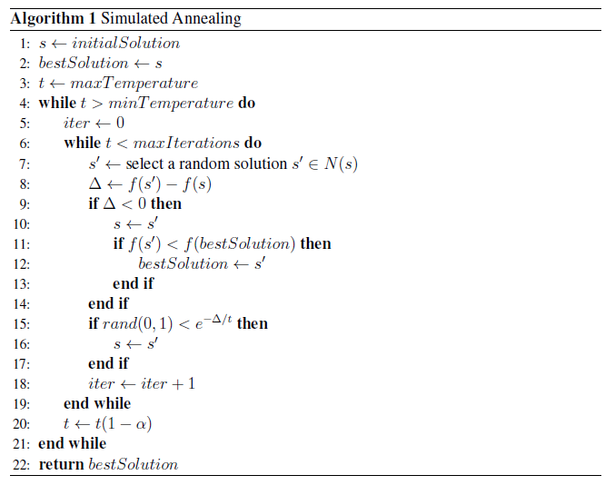

# Simulated-Annealing-and-Java-Interface
It's an internship project. One of the metaheuristic algorithms called Simulated Annealing is implemented. A user interface in which dataset(in Excel) can be imported and the results can be  accessed is also developed.

## Simulated Annealing Algorithm Pseudocode

  

